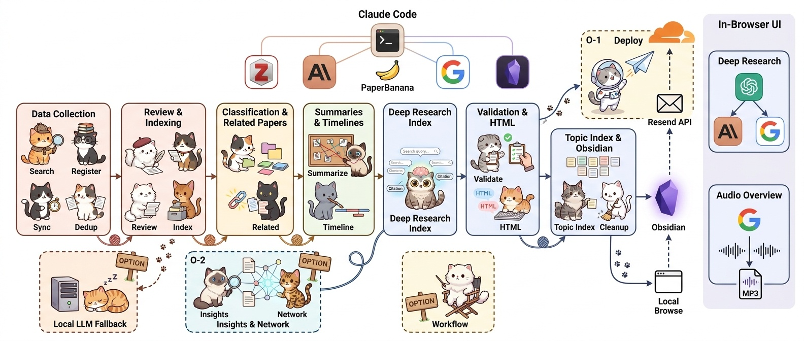

# Paper Curation

**Zotero 컬렉션에 PDF만 있으면, 나머지는 자동입니다.**

논문 PDF → 한국어 구조화 리뷰 → 자동 분류 → 연구 동향 타임라인 → 검색 가능한 사이트 + **Deep Research**(논문 근거 RAG Q&A)까지 — **로컬 Codex(ChatGPT 로그인)** 가 오케스트레이션하는 개인 논문 큐레이션 파이프라인.

**라이브 데모 — 설치 없이 바로 보기:**

- **Humanoid** — https://paper-curation.jehyunlee.dev/humanoid/
- **Physical AI** — https://paper-curation.jehyunlee.dev/physical-ai/

**핵심 기능 5줄 요약:**

- **리뷰 자동화** — PDF에서 텍스트·Figure를 추출해 Codex가 6개 섹션 한국어 리뷰를 자동 작성
- **분류·네트워크** — SPECTER2 + HDBSCAN + UMAP로 카테고리를 자동 생성·배정하고 D3.js 인터랙티브 네트워크로 시각화
- **Deep Research RAG** — 자연어 질의 → BM25 검색(선택: dense 하이브리드) → LLM 답변 + `[N]` 인용, 필요하면 **웹 검색 토글**로 코퍼스 밖 근거까지
- **Audio Overview** — 리뷰·답변을 팟캐스트형 한국어 오디오로(Gemini TTS → 브라우저 MP3, 로컬)
- **[paper-curio](https://github.com/jehyunlee/paper-curio)** — Zotero 플러그인에서 PDF AI Chat, 2~6편 비교 리포트, 컬렉션 우클릭 전체 처리(리뷰·분류·내러티브·main/category 타임라인, 배포 제외)

🇬🇧 [English README](README.en.md)

## 릴리스 상태 및 버전 관리

현재 프로젝트 버전은 **0.1.0**입니다. 정확한 버전은 저장소 루트의
[`VERSION`](VERSION) 파일이 단일 기준이며, 변경 내역은
[`CHANGELOG.md`](CHANGELOG.md)에 기록합니다.

### 0.1.0 — 2026-08-08

이번 릴리스에서 다음 작업을 완료했습니다.

- Codex saved-auth(ChatGPT 로그인) 기반 Terra/Luna 생성 게이트웨이와
  유료 API fallback 영구 차단
- setup/doctor/run_full의 fail-closed 정책 및 감사 가능한 release evidence
- BM25 기본 검색과 local Deep Research answer 서버
- one-paper fixture 기반 curation/cache/resume/release 검증
- Codex CLI `0.147.0` signed boundary 재검증
- release gate evidence `238 passed, 0 failed, 0 skipped`, F1~F4 최종 검토 PASS

> 참고: 고정 환경에서 전체 `unittest discover`를 실행하면 release gate 밖의
> 기존 metrics 테스트가 추가로 수집됩니다. 현재 `python-dateutil` 환경 누락과
> 오래된 pipeline wiring assertion 3 errors/1 failure가 남아 있으며, 이번
> 릴리스 변경에서 발생한 회귀는 아닙니다.

### 버전 규칙

- **SemVer**(`MAJOR.MINOR.PATCH`)를 사용합니다.
- `0.x.y` 단계에서는 호환 가능한 버그 수정·문서·테스트 변경은 PATCH를
  올리고, 기능 추가나 CLI/config/schema 동작 변경은 MINOR를 올립니다.
- `1.0.0` 이후 호환되지 않는 CLI/config/schema 또는 persisted-data 변경은
  MAJOR를 올립니다.
- 모든 릴리스는 `VERSION`, `CHANGELOG.md`, README의 릴리스 요약을 함께
  갱신하고, 검증 후 `vMAJOR.MINOR.PATCH` Git tag를 사용합니다.
- 프로젝트 버전과 Codex CLI 버전은 별개입니다. 현재 Codex CLI pin은
  `pipeline/codex-cli-policy.json`의 `0.147.0`입니다.



> 🐱 **한 장으로 보는 전체 파이프라인** — 수집부터 배포까지, 고양이들이 대신합니다.

## 목차

- [릴리스 상태 및 버전 관리](#릴리스-상태-및-버전-관리)
- [📖 독자로 둘러보기](#-독자로-둘러보기)
- [🔧 운영자로 설치하기](#-운영자로-설치하기)
- [💳 크레딧 가이드](#-크레딧-가이드)
- [기능](#기능)
- [파이프라인](#파이프라인)
- [사용 모드](#사용-모드)
- [문서](#문서) — Setup / Operations(megasearch · 한국 망 우회 · Concurrency) / Architecture
- [발표/참고자료](#발표참고자료)

## 📖 독자로 둘러보기

설치도, API 키도 필요 없습니다. 위 라이브 데모 링크를 열면 바로 열람할 수 있습니다.

- **웹에서 보기** — [Humanoid](https://paper-curation.jehyunlee.dev/humanoid/) · [Physical AI](https://paper-curation.jehyunlee.dev/physical-ai/). 카테고리별 카드, 검색, 타임라인, 논문별 한국어 리뷰 페이지가 모두 정적으로 제공됩니다.
- **Deep Research 사용법** — 토픽 페이지 상단의 검색창에 자연어로 질문하면 됩니다. **검색(retrieval)은 키가 전혀 필요 없습니다** — 질의 임베딩은 서버(worker `/api/embed`)가 대신 계산합니다. 답변 생성만 본인 API 키(BYOK)를 입력하면 되고, Anthropic·OpenAI·Google 키 prefix를 자동 감지해 그중 하나로 근거 답변을 스트리밍합니다. 코퍼스 밖 최신 정보가 필요하면 **웹 검색 토글**을 켜 인라인 링크 인용으로 보강할 수 있습니다.
- **RSS 구독** — 각 토픽은 Atom 피드를 제공합니다: [Humanoid feed](https://paper-curation.jehyunlee.dev/humanoid/feed.xml) · [Physical AI feed](https://paper-curation.jehyunlee.dev/physical-ai/feed.xml). 리더로 구독하면 새로 추가되는 리뷰를 받아볼 수 있습니다.

## 🔧 운영자로 설치하기

Zotero 컬렉션 + PDF만 있으면 됩니다. **유료 API 키(Anthropic/OpenAI/Google)가 필요 없습니다** — 생성은 저장된 ChatGPT Codex 로그인(saved-auth)으로 동작하고, 검색 인덱스는 로컬 BM25가 기본입니다.

**가장 쉬운 방법 — Codex에서 한 줄** (전체 설치 플로우는 [AGENTS.md](AGENTS.md)의 "Installation Flow (Codex)" 참고):

> "여기에 paper-curation을 설치해줘: https://github.com/jehyunlee/paper-curation"

**수동 설치:**

```bash
# 1) 클론 + 의존성 (단일 conda env: py312)
git clone https://github.com/jehyunlee/paper-curation.git && cd paper-curation
conda create -n py312 -c conda-forge python=3.12 pip -y && conda activate py312
pip install -r requirements.txt
```

> ⚠️ **Windows 첫 실행 주의** — 모든 파이프라인 명령은 `PYTHONUTF8=1` 접두사가 필요합니다(cp949 인코딩 회피). Python은 **3.12 단독**만 지원하며, 다른 인터프리터(예: 3.14)로 실행하면 `_env_guard`가 자동으로 py312로 재실행합니다. 클러스터링(UMAP/HDBSCAN)은 numba 때문에 3.14에서 죽으므로 py312를 지정하세요.

**필수 사전 조건 — Codex saved-auth 로그인:**

- ChatGPT 계정에 Codex 로그인이 저장되어 있어야 합니다(`codex login status` → `Logged in using ChatGPT`).
- 생성 역할은 **Terra**(긴 형식: 리뷰·타임라인 내러티브)와 **Luna**(짧은 형식: 요약·연결) 고정입니다. 유료 API 키로의 fallback은 **영구히 거부**됩니다(`allow_paid_api: false`).
- 파이프라인은 Codex 구독 크레딧을 소비합니다. 크레딧이 소진되면 Codex 호출이 거부되고 해당 단계는 실패 처리되며, 크레딧이 재충전된 뒤 재개할 수 있습니다(자동 재시도 아님 — `--resume`/상태 파일로 이어서 실행).

**설치 실행 → 첫 파이프라인:**

```bash paper-curation-command
# 3) config.json 생성(대화형) → 첫 파이프라인 실행 (--no-run으로 자동 실행 생략 가능)
PYTHONUTF8=1 python pipeline/setup.py
```

**설치 진단** — 문제가 있으면 아래 명령으로 py312 환경 · 필수 패키지 · Codex saved-auth · Zotero 연결을 한 번에 점검합니다:

```bash paper-curation-command
PYTHONUTF8=1 python pipeline/doctor.py --format json
```

사전 준비 체크리스트, config.json 스키마, 설치 확인, 문제 해결 → **[Setup Guide](docs/setup-guide.md)**

## 💳 크레딧 가이드

> 유료 API 키 기반 과금이 **없습니다**. 생성은 ChatGPT 구독에 포함된 Codex 크레딧을 사용합니다.

| 단계 | 모델/역할 | 비용 |
|------|------|------|
| 리뷰 · 연결 · 인사이트 | Codex **Terra** (long_form) | 구독 크레딧 |
| 요약 · 분류 보조 | Codex **Luna** (short_form) | 구독 크레딧 |
| 분류 | HDBSCAN + UMAP (로컬 결정론) | **LLM 호출 없음 → 크레딧 0** |
| 검색 인덱스 | 로컬 BM25 (기본) | 무료 — 네트워크·임베딩 호출 없음 |
| SPECTER2 임베딩 | 로컬 모델 (최초 1회 다운로드) | 무료 (한국망은 [AWS S3 미러](docs/operations.md#korean-network-workarounds) 사용) |

**운영 부담**: 구독 크레딧만 소비되므로 **월 운영비 $0 (유료 API 키 없음)**. 크레딧 소진 시 다음 재충전까지 Codex 단계가 대기/실패하며, `--llm-mode off`로 결정론 단계만 실행할 수 있습니다.

> **각주**: Deep Research 답변 생성은 독자 BYOK라 운영자 비용에 포함되지 않습니다. 배포(`--mode deploy`)는 제거되어 더 이상 지원하지 않습니다.

## 기능

**Core** — `run_full --mode curate` 한 줄이면 전부 생성됩니다:

| 기능 | 설명 |
|------|------|
| **구조화 리뷰** | PDF에서 텍스트/Figure 추출 → Codex(Terra)가 6개 섹션(Essence·Motivation·Achievement·How·Originality·Evaluation) 한국어 리뷰 자동 작성 |
| **자동 분류** | Bottom-up 토픽 모델링(SPECTER2 + HDBSCAN + UMAP)으로 카테고리 자동 생성·배정 — LLM 호출 없음 |
| **같이 보면 좋은 논문** | 임베딩 후보를 Codex(Luna)가 선별 — 관계 유형 + 한국어 이유 1문장. 망 장애에 강건(multi-round 재시도 + 연결 0개 논문 우선) |
| **Deep Research** | 자연어 질의 → BM25 검색(기본) → 로컬 서버(`serve_local.py`)에서 답변. 독자 BYOK(Anthropic·OpenAI·Google 키 자동 감지) |
| **Audio Overview** | 리뷰/답변을 팟캐스트형 한국어 오디오로(Gemini TTS, 브라우저 MP3 인코딩 → 다운로드, 로컬) |
| **타임라인** | 카테고리별 연구 동향 내러티브 + 다이어그램(PaperBanana) + main research timeline. `curate`에서도 누락 산출물은 기본 보강 |
| **지식 축적** | Obsidian 연동 — 메모가 다음 질의에 반영되는 compounding knowledge |
| **Citedby** | DOI 한 편에서 인용 계보·타임라인·내러티브·Deep(er) Research를 생성하고 PDF·Markdown·Obsidian·Audio로 출력 |
| **논문 검색/등록** | arXiv·Semantic Scholar·OpenAlex 병렬 검색 + Zotero 자동 등록(선택) |

**Option** — 플래그/모드로 켤 때만:

| 기능 | 켜는 법 | 설명 |
|------|---------|------|
| **Insights + 네트워크 (O-2)** | `--insights` | 크로스카테고리 인사이트 + UMAP 2D/3D 인터랙티브 네트워크 재생성 |
| **검색 인덱스 dense 보강** | `build_search_index.py --with-dense` | Google `gemini-embedding-001` 임베딩 추가(BYOK). 기본은 BM25-only |
| **워크플로 다이어그램** | `generate_workflow.py` | 상단 고양이 다이어그램 생성(PaperBanana, `--style cat/fairy/academic`) |

**필요한 것**: Zotero 컬렉션 + PDF + Codex saved-auth(ChatGPT 로그인). 유료 API 키는 **불필요**(`--llm-mode off`면 Codex조차 불필요 — 결정론 단계만 실행).

> ⚠️ **비활성화된 기능**: `--mode deploy`(Cloudflare 배포), `--local-fallback`(로컬 LLM fallback), 크로스카테고리 Insights 기본 생성은 **제거/비활성**되었습니다. 기록에 남아 있는 명령은 실행되지 않습니다(exit 2 또는 지원 중단 안내).

## 파이프라인

`run_full.py` 한 줄이 아래 Core 단계를 순서대로 실행합니다 (위 그림이 전체 흐름):

1. **데이터 수집** — Zotero PDF → `text.md` + `figures/` (선택: arXiv·S2·OpenAlex 검색 후 Zotero 등록)
2. **구조화 리뷰** — Codex(Terra)가 6섹션 한국어 `review.md`
3. **토픽 모델링 + 분류** — SPECTER2 + HDBSCAN + UMAP로 카테고리 자동 생성·배정
4. **같이 보면 좋은 논문** — 임베딩 후보를 Codex(Luna)가 선별(multi-round 재시도)
5. **카테고리 요약 + 타임라인 내러티브/main·category 다이어그램** & **Deep Research 검색 인덱스**(BM25 기본)
6. **토픽 인덱스** `index.html`(Deep Research·Audio Overview 내장) → **로컬 열람**(`serve_local.py`)

**브라우저 안에서**: Deep Research(키 자동 감지, BYOK)와 Audio Overview(Gemini TTS → MP3)가 동작합니다.
**Option 분기**: `--insights`(크로스카테고리 인사이트 + 네트워크) · dense 보강은 별도 `build_search_index.py` 실행.

**실패·재개**: 각 단계는 상태 파일로 추적됩니다. 실패 시 이전 단계 산출물 해시는 보존되고, `--resume`으로 실패한 단계부터만 재실행됩니다(전체 재생성 아님). 파이프라인은 **git 히스토리를 재작성하지 않습니다** — 산출물(리뷰·인덱스·HTML)은 재생성 가능하지만 저장소 히스토리는 불변입니다.

## Citedby — 한 논문에서 시작하는 인용 계보 분석

DOI 또는 로컬 리뷰 논문을 기준으로 OpenAlex·Scopus·Semantic Scholar·arXiv에서
인용논문을 수집하고, 시간에 따른 연구 흐름을 자기완결 HTML 보고서로 만듭니다.

```bash paper-curation-command
PYTHONUTF8=1 python pipeline/run_citedby.py \
  --doi 10.xxxx/xxxxx \
  --pdf-first --build-index --serve --open
```

- **인용 흐름 타임라인** — 연구 주제의 생성·소멸·분기·융합, turning-point 논문,
  주요 연구 그룹을 2–3단락의 종합 narrative와 stream별 설명으로 정리
- **PaperBanana 시각화** — 타임라인 그림과 narrative를 기본 생성
  (`--no-timeline`으로 생략)
- **PDF-first 근거 등급** — 기존 corpus 리뷰 > Zotero 보유 PDF 전문 > 초록 > 제목
- **Deep(er) Research** — BM25+dense hybrid retrieval, 답변 계획, related-paper 탐색,
  선택적 웹 검색, streaming 답변 및 `[ref:N]` 인용
- **Corpus 우선 identity 통합** — 웹 검색 결과가 corpus 논문과 DOI·arXiv·제목으로
  일치하면 외부 자료를 중복 인용하지 않고 기존 corpus reference를 사용
- **문맥별 링크** — 로컬 HTML은 corpus review HTML, PDF는 DOI·arXiv·원문 URL,
  Obsidian은 `papers/{slug}/review.md` 또는 citedby evidence note로 연결
- **독립 출력** — Citedby 보고서와 Deep(er) Research 답변 각각
  PDF·Markdown·Obsidian·Audio Overview 지원
- **로컬 서버 열람** — `--serve --open`으로 `file://` 대신
  `http://localhost:8000/...`을 열어 embedding·streaming·Audio API를 바로 사용

**CLI/에이전트 검색** — 인덱스를 재빌드하지 않는 읽기 전용 질의 경로:

```bash paper-curation-command
# 통합 컬렉션(_cross), 키 없이 BM25
python pipeline/query_search_index.py --query "과학적 발견 자동화" --mode bm25

# 구조화 JSON 출력
python pipeline/query_search_index.py --topic humanoid --query "VLA action tokenization" --json
```

기본 컬렉션은 `_cross`이며 `bm25`가 기본 모드입니다(`hybrid`/`dense`는 dense 인덱스가 존재할 때만).
Python에서는 `pipeline.api.query_search_index()`를 호출합니다. 질의는 인덱스를 변경하지 않습니다.

**검색 품질 회귀 테스트** — 8개 컬렉션의 고정 40질의·고정 query vector로
`recall@5/10`, `MRR@10`, 실패 질의를 네트워크 없이 측정합니다. 인덱스 재빌드 뒤에는
해당 컬렉션과 `_cross`가 baseline보다 하락하면 검색 품질 경고를 냅니다.
초기 `retrieval-v2-bootstrap`은 BM25 top-1 known-item 라벨이므로 절대 품질 점수가 아니라
회귀 감지용입니다. 평가 자료·결정 기록은 `pipeline/eval/`에 있습니다.

단계별 입력·처리·출력 상세 → **[Architecture & Internals](docs/architecture.md)**

## 사용 모드

단일 오케스트레이터 `run_full.py` (3축: `--mode` / `--source` / `--images`):

```bash paper-curation-command
# 주간 운영 — 검색 → Zotero 등록 → sync → 신규 리뷰 + timeline 보강
PYTHONUTF8=1 python pipeline/run_full.py --topic ai4s --mode curate --source web --days 7

# 로컬 업데이트 — 검색 스킵, 신규/누락 narrative·timeline 기본 보강
PYTHONUTF8=1 python pipeline/run_full.py --topic ai4s --mode curate --source zotero

# 분류만 / 타임라인만
PYTHONUTF8=1 python pipeline/run_full.py --topic ai4s --mode reclassify
PYTHONUTF8=1 python pipeline/run_full.py --topic ai4s --mode retime --images all

# 실행 계획 미리보기 / 로컬 서버
PYTHONUTF8=1 python pipeline/run_full.py --topic ai4s --mode curate --dry-run
PYTHONUTF8=1 python pipeline/serve_local.py     # localhost:8000 + /api/embed + /api/citedby-answer
```

**LLM 모드(`--llm-mode`)**: `codex`(기본 — saved-auth 생성) | `off`(생성 단계 전부 건너뛰고 결정론 단계만, 정책 거부 exit 3). 유료 API 모드는 존재하지 않으며 `allow_paid_api: true` 설정은 영구 거부됩니다.

**로컬 서버 필수**: Deep Research·Citedby의 embedding/streaming/Audio API는 로컬 서버(`serve_local.py`)가 필요합니다. `file://`로 직접 열면 "local server required" 안내가 표시됩니다.

전체 모드 표, 안전 플래그, Concurrency 튜닝, 복구 절차 → **[Operations Manual](docs/operations.md)**

## 문서

| 문서 | 내용 |
|------|------|
| **[Setup Guide](docs/setup-guide.md)** | 사전 준비 · Codex/수동 설치 · config.json · 설치 확인 · 문제 해결 |
| **[Operations Manual](docs/operations.md)** | 모드/안전 플래그 · Concurrency · 한국 망 우회(SPECTER2/arXiv) · 복구 |
| **[Architecture & Internals](docs/architecture.md)** | 파이프라인 단계 상세 · 신뢰성 설계 · 내부 구조 · Karpathy LLM Wiki 비교 · 요구사항 |
| **[English README](README.en.md)** | Full English documentation |

## 발표/참고자료

이 프로젝트는 **AAiCON 2026** (국립중앙과학관, 2026.06.25–26)에서 발표되었습니다.

| 형식 | 자료 |
|------|------|
| **구두 발표** | [260625_이제현_AAiCon.pdf](docs/public/260625_이제현_AAiCon.pdf) |
| **포스터** | [260625_이제현_AAiCon_poster.pdf](docs/public/260625_이제현_AAiCon_poster.pdf) |
| **AIX 클리닉 1회** | [AIX 클리닉 1회 (KIST 존슨강당, 2026.07.16.)](docs/public/260715_AIX_clinic_paper_curation.pdf) |

---

*Built with Codex.* 🐱
